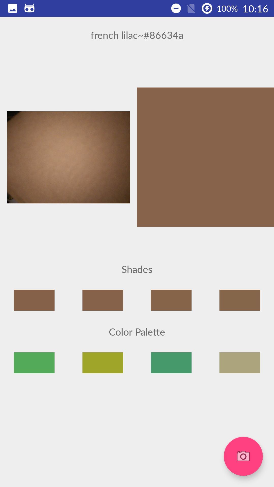
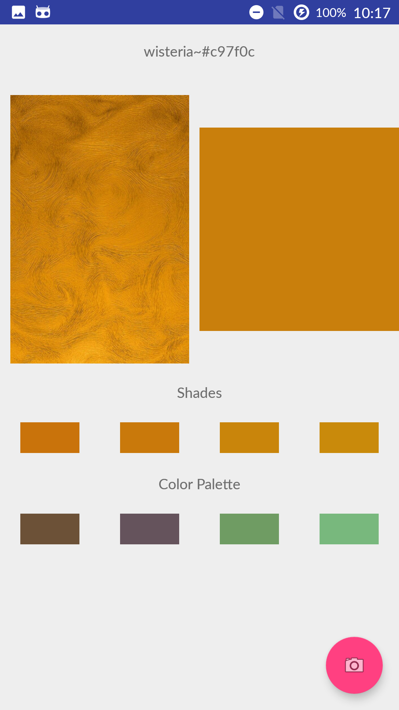
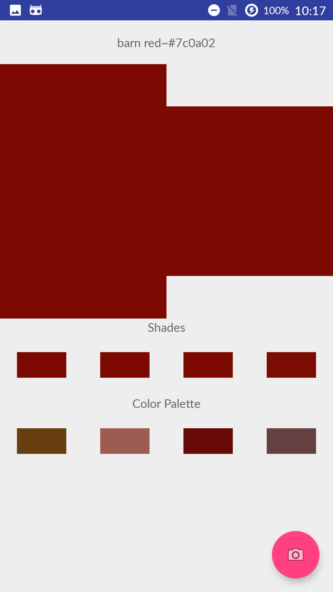
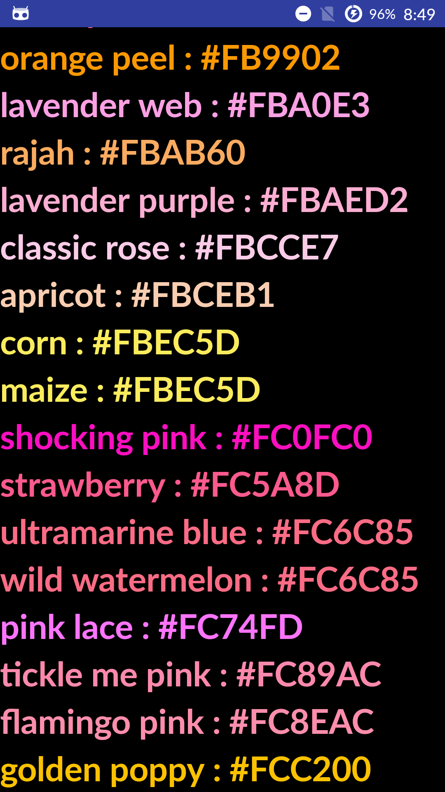
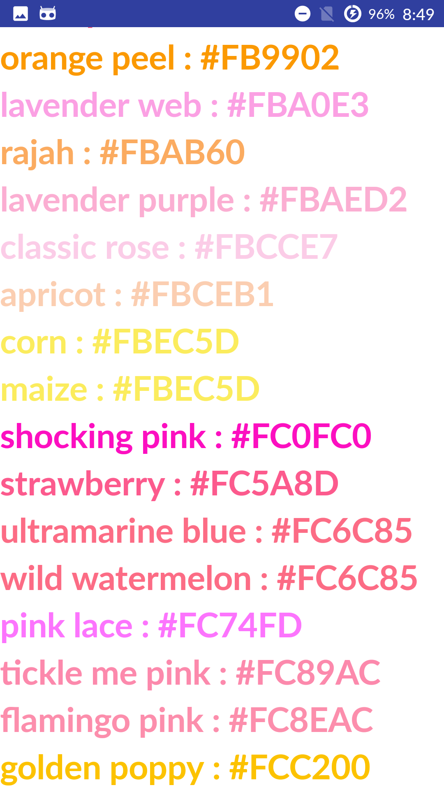

# ColorPalette
A simple app that allows a user to either 

|take a photo                 |select an image from the gallery|or provide a hex color code     |
|-----------------------------|--------------------------------|--------------------------------|
|  |  |  |

and then creates a color palette based on the user's selection.

Once the color is determined, the app displays its hex code, along with the name of the closest known color (selected from [Wikipedia's List Of Colors](https://en.wikipedia.org/wiki/List_of_colors:_A%E2%80%93F))

The app also contains the full list of wikipedia colors. They are listed with their name and hex code and sorted by hex code. Unfortunately, there is no way to one-dimensionally sort colors that makes sense to the human eye, so some may seem out of order.
The colors can be displayed against a white or black background, toggleable by tapping the background.

| Black background              | White background               |
|-------------------------------|--------------------------------|
|||

### Planned Features (sorted by priority)
* Save a color palette for future use
* More accurate color palettes
* Scrape Wikipedia's color page regularly for a full list of colors automatically (currently, it only does this when a python script is run manually)
* Make the app look a lot prettier
* Provide more options for background colors in the "View Colors" section

### Known Issues (sorted by order discovered)
* Selected shades are basically being created as colors indistinguishable from the original color
* There's no actual scrollbar in the scrolling "View Colors" section
